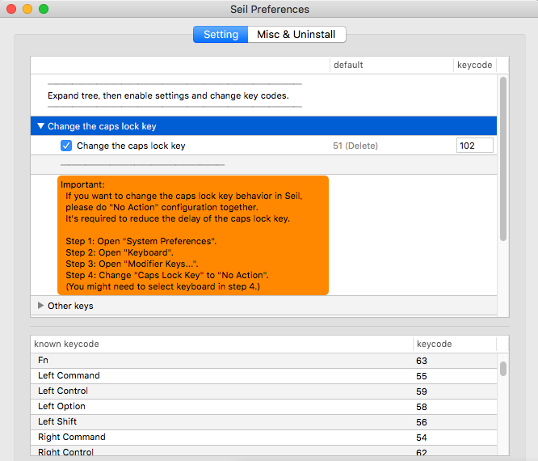
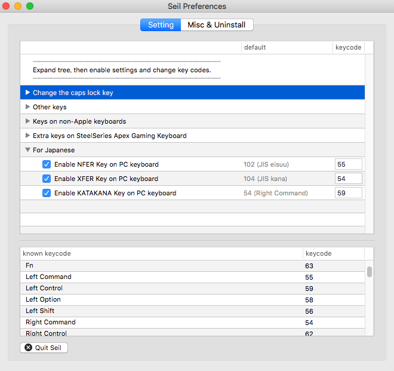

# MicroTronセットアップ
## Requirements
* Seil
  * 無変換、変換の認識

## capsキーを変更する

* システムメニューでcapsキーをアクションなしにする
* 画像のようにseilの設定を任意のキーにする

## 無変換、変換キーを別にキーに割り当てる

* jis eisu => 55
* jis kana => 54
* kana => 59
