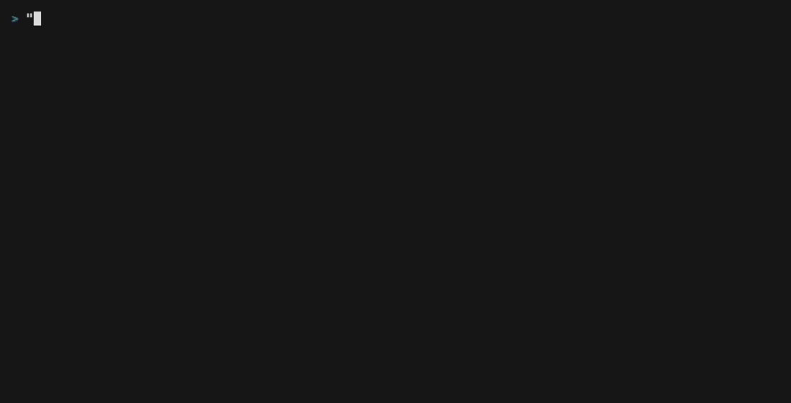
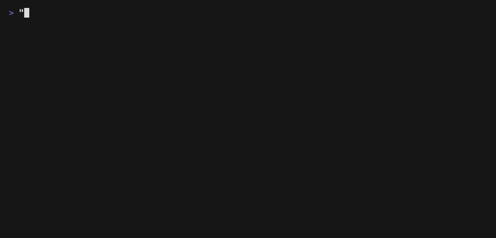

# tuikit — 端末 UI の部品

glogx の issues viewer で作り込んだ「一覧 → 詳細」の画面遷移・演出・幅計算を、別の TUI でも
使えるように切り出した部品集。**描画フレームワークに依存しない** (bubbletea v1 / v2 のどちらでも、
それ以外でも使える)。入出力は「1 要素 = 1 行」の `[]string` と、壁時計で進む小さな状態機械だけ。



(gif は演出を 3 倍に伸ばして撮っている。実速度は `go run ./examples/listdetail` で見る)

## パッケージ

| パッケージ | 中身 | 使いどころ |
|---|---|---|
| `termwidth` | 表示幅の単一情報源 (`Of` / `Truncate` / `Clip` / `PadSpaces` / `FillRight` …) | 行を幅で切る・揃えるときは**必ずここを通す** |
| `widthenv` | 幅モデルが支持しない環境変数 (`RUNEWIDTH_EASTASIAN`) の検出 | 起動時の警告・テストのガード |
| `sgr` | 基本の ANSI 色・装飾 (`Reset` / `Bold` / `Dim` / `Cyan` …) | 色を付けるときの値の単一の出典 |
| `anim` | `Transition` (開く / 閉じる / 途中で逆再生) / `Elapsed` (一方向の演出の進捗) / `ScrollGlide` / `CursorGlide` / easing | 開閉演出と「数行ぶんの移動を滑らせる」演出 |
| `layout` | `ComposeDrawer` (一覧の上に詳細を右から重ねる) / `DrawerGeometry` / `SlideIn` / `Scrollbar` / `Panel` (落ち影つきの板) / `Overlay` / `OverlayCentered` / `PadTo` | 画面の合成 |
| `confirm` | y/N 確認ダイアログ: `Dialog` (本文 + 空行 + 案内の板) / `Box` (幅 44 で頭打ちの中央の板) / `IsYes` (y・Y・Enter) / `IsYesStrict` (y・Enter) / 案内の定型 `HintYesNo` / `HintYesOther` | 破壊的操作の確認を毎回組まない。語彙の正本は `docs/glogx-ui-guide.md` §4 |
| `lineedit` | 1 行の入力欄 (カーソル + readline の編集キー: `ctrl+h` / `ctrl+w` / `ctrl+u` / `ctrl+k` / `ctrl+a` / `ctrl+e` …)。`Window(幅)` は欄に出す文字列とキャレットの桁 (長ければキャレットが欄に収まるよう前を切る。全角は 2) | 入力欄を毎回書かない。キーの語彙の正本は `docs/glogx-ui-guide.md` §7 |
| `caret` | `At(x, y, 幅, 高さ)`: 入力欄のキャレットに置く棒の端末のカーソル (bubbletea v2 の `tea.Cursor`。幅の外の桁は最終列へ寄せ、画面の外の行なら nil) | IME の変換中の文字を入力欄に出す (IME は端末のカーソルの位置に出す)。桁は `lineedit.Line.Window` の「欄の左端 + 桁」。**tuikit で唯一 bubbletea を import する** (置く先が `tea.Cursor` そのもの)。pro-con の入力欄・回答フォームと schedkeys が使う (issue 517) |
| `editor` | 実ファイルを 1 つエディタで開くコマンド ($VISUAL → $EDITOR → nvim、空白で語分割、quote は解釈しない) | glogx と pro-con の共通。tea.ExecProcess で待つ前提 (GUI エディタは -w) |
| `toast` | 右下に数秒だけ出る通知のスタック: `Stack` (`Show` 成功 ✓緑・失敗 ✗赤 / `ShowInfo` 進行中 …シアン / `Advance` / `StartLeaving` / `BoxLines`)。右外から滑り込み、`Hold` (3 秒) 止まって、右へ滑り出る。`BoxLines` には重ねる窓の幅を渡す: 収まらない文は箱の中で折り返し (最大 `MaxTextLines` 行。超えた分は末尾を … にする)、窓の右端で切れない。新しい通知は上に積み、古い通知は下から抜ける (最大 3 枚。溢れたら成功・進行中から捨て、警告は残す)。タイマーは張らず `Timer` として返す | 操作の結果を画面の邪魔をせずに知らせる (glogx の push / pull の結果など)。デモの gif は下の「デモ」 |
| `markdown` | markdown の本文を幅で整形する `Render(src, width, colored)` (見出し・箇条書き・チェックボックス・引用・表・水平線・フェンスコードの chroma ハイライト。行ごとのソース行番号も返す)。出力は width 桁を超えず、`colored=false` なら ANSI を出さない。本文の制御文字は termsafe で落とす | issue の本文 (glogx) と PG の応答の文 (pro-con の詳細) を同じ見た目で出す |
| `highlight` | `Diff(lines)` (git の `--color=never` の diff に構造色 + chroma のシンタックスハイライト。行数は変えない) / `Code(lexer, 1 行)` / `Lang(言語名, 1 行)`。入力の無害化は使う側 (termsafe) | glogx の diff の板・pro-con の差分の板・markdown のフェンスコードで同じ色付けを使う |
| `listnav` | `MotionOf` (キー → 移動の語彙) / `List` (一覧のカーソル + 窓 + 半ページの滑走) / `Pager` (本文のスクロール) / `Scroll` / `WindowOffset` / `ClampOffset` (窓の計算) | 一覧・本文の移動を毎回書かない |

## 遷移のパターン

### 一覧 → 詳細: 右から滑り込む引き出し

詳細は一覧を全画面で置き換えず、**右外から滑り込む板**として一覧の上に重ねる。左に一覧の端
(番号・状態・カテゴリ) が残るので、「どの一覧のどこから開いたか」が画面から消えない。

```go
var geo = layout.DrawerGeometry{Ratio: 0.8, Extra: 10, MinList: 8, MaxPeek: 18}
var drawer anim.Transition // zero value = 閉じている

// 開く / 閉じる (所要は動き始めるときに渡す)
drawer.Open(now, 112*time.Millisecond)
drawer.Close(now, 112*time.Millisecond)

// 描画: 詳細は開ききった幅 (geo.Target) で整形しておき、演出中は切るだけ
w := layout.DrawerWidth(geo.Target(width), drawer.Openness(now, anim.EaseOutCubic))
screen := layout.ComposeDrawer(listLines, detailLines, w, width, colored)

// tick のたびに: 閉じ切ったら中身を捨てる
if drawer.Settle(now) { detail = nil }
```

- 閉じる動きは開く動きの**逆再生** (同じカーブを反転して通る)。途中で向きを変えても見えている位置は跳ばない
- 開いたまま隣の項目へ送るときは `Open` を呼ばずに中身だけ差し替える (板が動かないので、左に覗く一覧のカーソルが追従して見える)

### 一覧を開く: 上から順に右から流れ込む

```go
if p := anim.Elapsed(openedAt, now, 175*time.Millisecond); p < 1 {
	screen = layout.SlideIn(screen, p, width, false, 0.35)
}
```

入ってくるときは行ごとに開始をずらし (stagger)、終端で減速する。**閉じるときは全行同時・等速**
(`closing=true`)。着地点の無い板に減速を掛けると「もう見えないのに畳まれない時間」になる。

### 数行ぶんの移動を滑らせる

- `ScrollGlide`: 表示 offset を論理 offset へ数フレームで寄せる (本文の半ページスクロール)。連打中は積み上げずに即時へ倒す
  (ふつうは `listnav.Pager` / `listnav.List` 越しに使う。直接使うのは offset を自分で持つ画面)
- `CursorGlide`: **描画カーソルだけ**を滑らせる (一覧の半ページ移動)。窓は論理カーソルを含む最小の窓のまま動かさないので、Enter などの決定キーは常に着地点へ効く

```go
glide.Start(prev, offset, 6) // 6 フレーム (× tick 16ms ≒ 100ms)
drawn := glide.Offset(offset) // 描画だけこの値を使う。論理 offset は使う側が持つ
if glide.Active() { glide.Advance(offset) } // tick のたびに
```

### 一覧を動かす: キーの語彙・カーソル・スクロールバー

一覧を持つ画面で毎回書いていた「j/k・g/G・半ページ・滑走・窓の追従・スクロールバー」は `listnav` と
`layout.Scrollbar` で済む。

| 移動 | vim (一次) | emacs / 矢印 (別名) |
|---|---|---|
| 1 行下 / 上 | `j` / `k` | `ctrl+n` `↓` / `ctrl+p` `↑` |
| 半ページ下 | `ctrl+d` `Space` `f` | `pgdown` |
| 半ページ上 | `ctrl+u` `b` | `pgup` `shift+space` |
| 先頭 / 末尾 | `g` / `G` | `home` / `end` |

```go
var list listnav.List // zero value = 先頭

// キー: 画面固有の動作キー (Enter で開く・Space で選択 など) を先に捌き、残りを語彙へ渡す
list.Move(listnav.MotionOf(key), len(items), rows, 20) // 半ページは 20 フレームかけて滑る

// 描画: 窓 (list.Offset から rows 行) を組み、滑走中の描画カーソルに印を付け、右端にバーを足す
cur := list.DrawCursor(len(items))
lines = layout.Scrollbar(lines, width, len(items), list.Offset, colored) // 行は width-ScrollbarWidth で組む

// tick のたびに
list.Advance()
```

- 半ページ移動では**論理カーソル (`list.Cursor`) は即座に着地**し、描画カーソルだけが滑る。窓は論理カーソルを
  含む最小の窓のまま動かさないので、Enter などの決定キーは常に着地点へ効く
- 本文 (カーソルの無いスクロール) は `listnav.Pager`。半ページだけが滑り、1 行送りと端へのジャンプは即時
- 🚨 `Pager` は描画で行数が確定するたびに `Clamp(total, rows)` を呼ぶ (`DrawOffset` の前)。呼ばないと、
  折り返しが減った・窓が広がった後の上スクロールが「超えた分」だけ空振りする (理由は `Pager.Clamp` の doc)
- 🚨 動作キーと語彙がぶつかる画面 (Space = 選択、`b` = push など) は、**その画面の動作を先に捌く**。
  `MotionOf` は画面ごとの例外を持たない (持たせると画面ごとに効くキーがまたずれ始める)
- 表示行数 `rows` が 0 以下でも 1 行として扱う (窓や offset が行数を超えない)。rows=1 の半ページは
  窓の高さ以上に動くので滑らせない (起点が窓の外だと、滑走の間カーソルの強調が描かれない)
- 🚨 「知らないキーは中止に落とす」ような安全側の確認画面には `MotionOf` を当てない (中止のつもりの打鍵が
  移動に化ける)。送るキーはその画面で 1 つずつ列挙する
- Space は bubbletea v1 が `" "`、v2 が `"space"` と綴るが、`MotionOf` は両方を受ける

### 板を浮かせる: 落ち影つきの枠と、中央に重ねる合成

モーダル・トースト・詳細パネルに使う「罫線の枠 + 右下の落ち影」の板と、それを背景の上に重ねる合成。

```go
box := layout.Panel("確認", rows, contentW+layout.PanelChrome, colored,
	layout.PanelStyle{Border: layout.BorderLight, Color: sgr.Dim}) // 影の色の既定は近黒
screen = layout.OverlayCentered(screen, box, width, page, colored)  // 左右の背景 (色も) を残して中央に重ねる
```

- `Panel` の各行の表示幅は `width + Indent` ちょうど (中身が長ければ `…` で切り、短ければ埋める)
- 色なし (`colored=false`) では中身の SGR も落とす (閉じていない色が後続の行へ滲まない)
- `Overlay` は行ごと置き換える (下に収まらなければ引き上げる)。`OverlayCentered` は板が占める列だけを差し替える

### 確認する: y/N のダイアログ

一覧の上に中央の板を浮かべた姿 (実際の出力から色を落としたもの。左右の背景は残る):

```text
  docs/old┌ 削除 ───────────────────────────────────┐
  docs/dra│ 次のファイルを削除します                │▓
→ scripts/│   scripts/legacy_sync.sh                │█
  tmp/benc│                                         │█
  tmp/prof│ y/Enter: 実行   その他: キャンセル      │█
  src/tuik▖▁▁▁▁▁▁▁▁▁▁▁▁▁▁▁▁▁▁▁▁▁▁▁▁▁▁▁▁▁▁▁▁▁▁▁▁▁▁▁▁▁▗█
            ▓█████████████████████████████████████████
```

```go
if asking {
	box := confirm.Dialog(" git push ", []string{"未 push の 3 コミットを push します"}, confirm.HintYesNo, width, colored)
	screen = layout.OverlayCentered(screen, box, width, page, colored)
}
// キー: 確認中は何が来ても確認を閉じ、実行キーのときだけ実行する
asking = false
if confirm.IsYes(key) { run() }
```

- 🚨 **実行キー以外はすべて取り消しに倒す** (n / Esc を待たない)。知らないキーで実行されるのが最悪の失敗
- 🚨 **確認中のキーに `listnav.MotionOf` を当てない** (取り消しのつもりの打鍵が移動に化ける)。対象が板に
  入り切らず送らせたいなら、送るキーを画面側で 1 つずつ列挙する (glogx の doctor の削除確認)
- 板は `confirm.MaxWidth` (44 桁) で頭打ち。宛先・パスのように切れると確認の意味が無くなるものは独立した行にする

## 使う側の約束

- **tick は使う側が回す**。`Transition.Animating(now)` / `List.Animating()` / `Pager.Animating()`
  (直接使うなら `ScrollGlide.Active()` / `CursorGlide.Active()`) のどれかが真のあいだは再描画を続ける (tuikit は tick を持たない。フレームワーク非依存にするため)
- **時刻は引数で渡す** (部品の中で `time.Now` を呼ばない。lint が止める)。使う側のテストで時刻を固定できる
- **演出中に来たキーは、先に着地させてから効かせる** (`Finish()` / `Stop()`)。演出の終わりまで入力を待たせない
- **閉じる演出のあいだは中身を捨てない**。捨てるのは `Settle` / `Finish` が `closed=true` を返してから
- 詳細は**開ききった幅で整形**して渡す。途中の幅で整形し直すと毎フレーム折り返しが変わって文字が踊る
- 幅は `termwidth` だけで測る。別の幅ライブラリ (runewidth 等) を混ぜると、枠の計算が端末・locale でずれる
- `colored=false` で合成するなら、**渡す行に SGR を含めない** (色を付ける処理そのものを `colored` で止める)。
  layout は色なしのとき reset を 1 つも出さないので、閉じていない SGR があると区切り線・隣の板・後続の行まで
  色が続く。中身の SGR を自分で落とすのは `Panel` だけで、`ComposeDrawer` / `Scrollbar` / `OverlayCentered` は落とさない
- `layout.Overlay` / `OverlayCentered` は**渡した行をその場で書き換える** (`PadTo` の返り値も渡した行と裏の配列を共有する)。
  キャッシュした行・別の画面と共有している行は、コピーしてから渡す
- `RUNEWIDTH_EASTASIAN` が真だと罫線が幅 2 になり枠が崩れる (この env には対応していない)。起動時に
  `widthenv.EastAsianAmbiguous()` で検出して `widthenv.Message` を出し、幅に依存するテストは `TestMain` で
  `widthenv.ExitIfUnsupported()` を呼ぶ

## 不変条件の守り

| 何を | どこで |
|---|---|
| 部品 (`anim` / `confirm` / `layout` / `listnav` / `sgr` / `termwidth` / `widthenv`) は bubbletea を import しない | `.golangci.yml` の depguard |
| 部品の中で `time.Now` / `time.Since` を呼ばない | `.golangci.yml` の forbidigo |
| 幅モデルは 1 系統 (runewidth・uniseg・`ansi.StringWidthWc` を使わない) | `.golangci.yml` の depguard / forbidigo |
| VS16 付きの文字列リテラルを書かない / 2 本目の幅エンジンを使わない | glogx の `own_sources_test.go` 経由の走査 (tuikit も対象。走査の根は glogx の go.mod の replace と突き合わせて固定) |
| glogx の一覧 4 画面が移動の語彙を `listnav.MotionOf` から取り、半ページが `listnav.Half(各画面が基準に渡す行数)` | glogx の `motion_vocabulary_test.go` (入口 `browseModel.handleKey` から、別名と一次語彙の結果の一致と、半ページの移動量を見る) |

CI は `.github/workflows/src_tuikit.yml` (lint + test)。tuikit を変えると glogx の CI も走る
(`src_glogx.yml` の paths に `src/tuikit/**` がある)。

## デモ

```sh
cd src/tuikit
go run ./examples/listdetail          # 実速度で触る
go run ./examples/listdetail -slow 3  # 演出を 3 倍に伸ばす
go run ./examples/toast               # 通知 (s 成功 / f 失敗 / i 進行中 / l 長い通知 / q 終了)
make demo                             # vhs で 2 つの gif を撮り直す (vhs が要る)
```

撮る手順は [`examples/listdetail/demo.tape`](examples/listdetail/demo.tape) と [`examples/toast/demo.tape`](examples/toast/demo.tape)。部品や演出を変えたら撮り直す。



- vhs (xterm.js) の描画では、縦の罫線 `│` が字の高さまでしか描かれず、箱の下の辺の角 (`▖` / `▗`) が小さな四角になって縦の線と繋がらない。
  本物の端末では繋がって描かれる (gif だけの見え方の違い)

- 🚨 デモの状態記号は ASCII にしてある。`○ ● ✓` のような East Asian Ambiguous の字は、vhs の描画
  (xterm.js) が 2 桁と数えて差分描画の位置がずれ、gif でだけカーソル行の反転が消える (tmux では正しく出る)

## 取り込み方 (dotfiles の中から)

```
// go.mod
require tuikit v0.0.0
replace tuikit => ../tuikit
```
